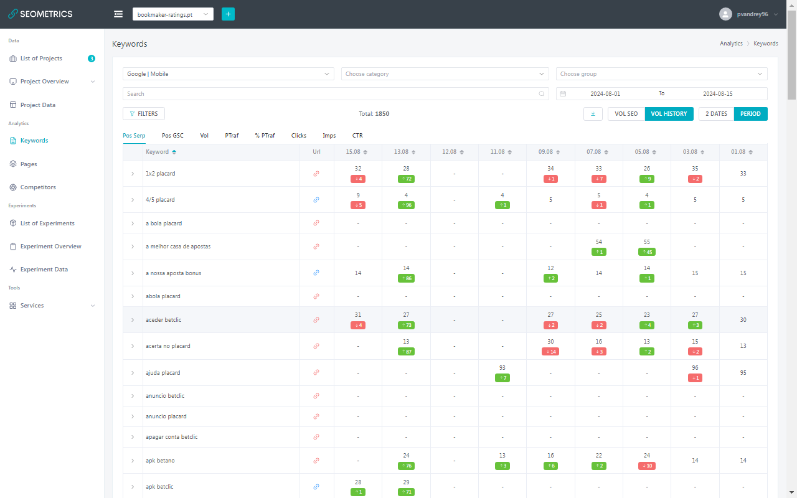

# Разработка панели SEO-аналитики для компании "Рейтинг Букмейкеров"

**Заказчик:** Компания "Bookmaker-Ratings" 
**Проект:** Панель SEO-аналитики 
**Задачи:** Поэтапная разработка с нуля 
**Роль:** Frontend разработчик 
**Стек:** Vue 3 | Composition API | JS | Pinia | TypeScript | Element-Plus | Highcharts | Vite | Axios

